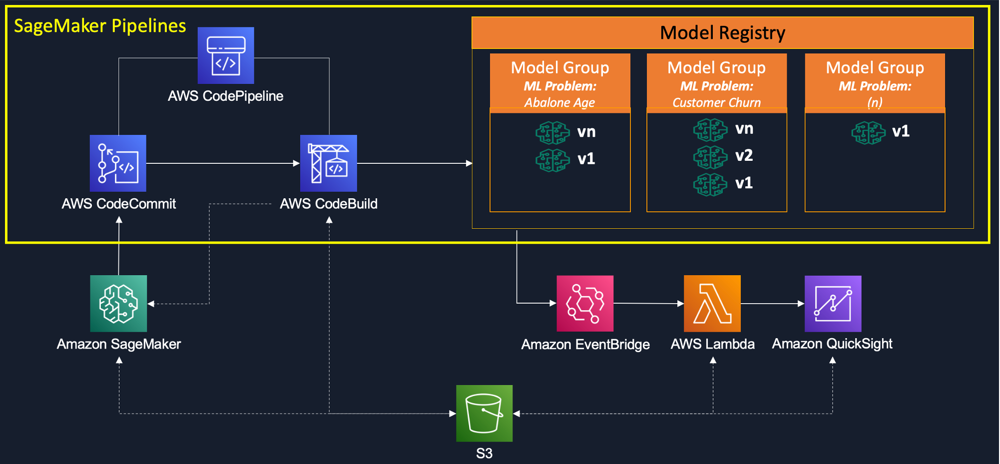
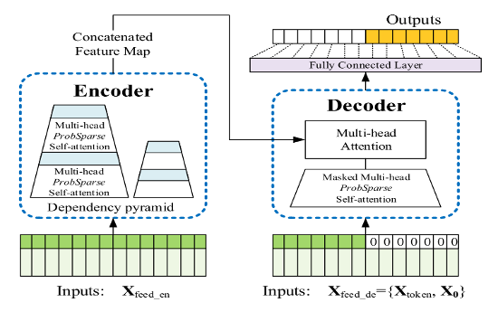
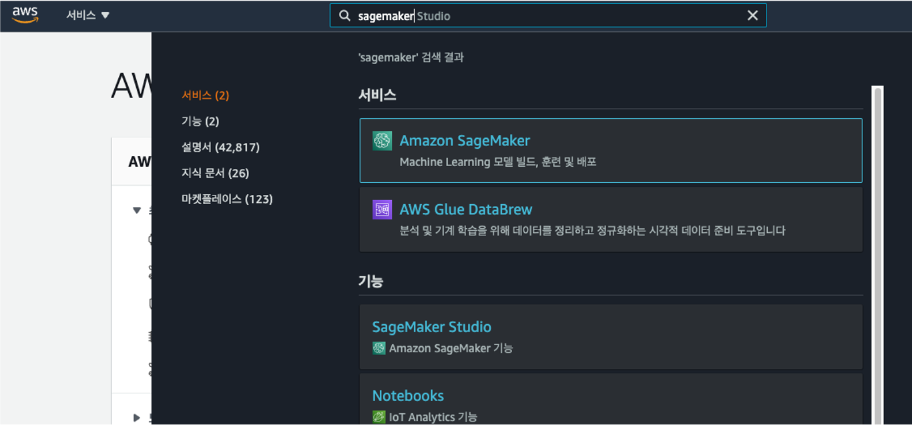
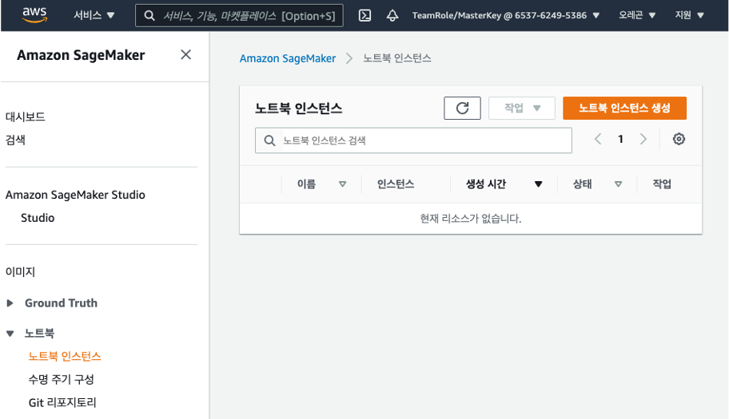
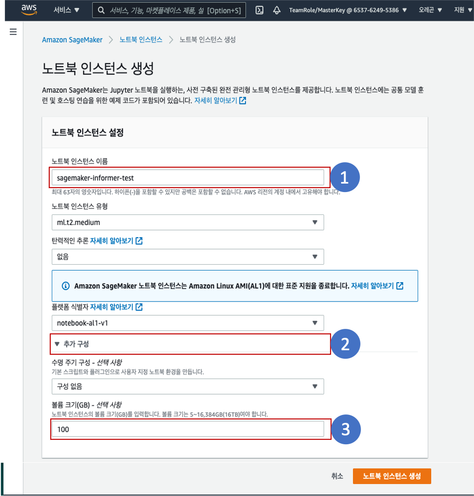
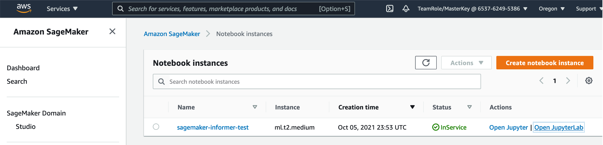
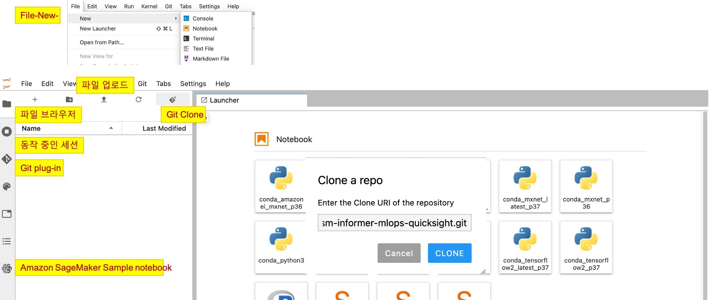

# Amazon SageMaker를 이용한 시계열 학습과 MLOps 구성
## 1. 개요
이번 HOL(Hands-on-Labs)는 SageMaker에서 Time series 모델을 학습하는 방법과 함께 SageMaker Pipelines을 이용하여 간단한 MLOps를 구성하는 실습 과정입니다.
전체 아키텍처는 다음과 같습니다.

**1번 노트북**은 SageMaker에서 managed training을 통해 Time series 모델을 학습하는 방법에 관련된 HOL 입니다. 실습을 위해 2021년 AAAI (Association for Advancement of AI) 컨퍼런스에서 Best Paper를 수상한 [Informer: Beyond Efficient Transformer for Long Sequence Time-Series Forecasting](https://arxiv.org/abs/2012.07436)를 이용하여 구성을 하였습니다. 활용한 소스코드는 해당 논문의 공식 예제인 https://github.com/zhouhaoyi/Informer2020 에서 가져왔으며, 이 코드에서 SageMaker 학습과 Pipeline을 위해 일부 수정하였으며, 이후 예측할 수 있는 코드를 추가하였습니다.

**2번 노트북**은 SageMaker Pipeline과 관련된 내용으로, 1번 노트북에서 활용한 학습 코드를 기반으로 Pipeline을 구성하는 방법을 단계별로 보여주고 있습니다. 각 단계를 노트북에서 테스트해보고 발생할 수 있는 오류는 바로 확인할 수 있는 HOL을 제공하고 있습니다.

**3번 노트북**은 MLOps를 구성하는데 추가적으로 필요한 IAM 설정, Amazon EventBridge, AWS Lambda와 Amazon QuickSight와 관련된 설정들이 들어가 있습니다. 2번 노트북까지 작업한 내용을 SageMaker Pipeline의 MLOps 구성에 반영하여, 모델 학습 스크립트를 소스코드 저장소인 AWS CodeCommit에 push하게 되면, 다음 스텝으로 모델 학습과 모델 구성이 자동으로 진행할 수 있도록 AWS CodePipeline을 활용하게 됩니다. 이후 Model Registry에 모델을 등록이 되어 Approval을 수동으로 선택하게 되면, 이 event를 Amazon EventBridge에서 판단하여 다음 단계인 AWS Lambda에서 추론으로 SageMaker의 Batch 작업을 수행하여 최종 결과물을 S3에 저장하게 됩니다. 저장된 S3의 CSV 파일을 Amazon QuickSight에서 읽어서 예측 결과를 visualization하는 것으로 이 HOL은 끝나게 됩니다.

## 2. 실행 방법

##### 1. AWS로 로그인을 한 다음, 아래와 같이 Amazon SageMaker를 검색합니다.

##### 2. 왼쪽 메뉴판에서 노트북-노트북 인스턴스를 선택한 다음, 오른쪽 상단의 주황색 **노트북 인스턴스 생성** 버튼을 클릭합니다.

##### 3. **노트북 인스턴스 이름**에 원하는 노트북 이름을, **추가구성-볼륨크기**은 100GB 이상으로 변경한 다음, 오른쪽 하단의 주황색 **노트북 인스턴스 생성**을 클릭하시면 됩니다. 만일 **IAM 역할**이 필요한 경우 **새 역할 생성**을 하시여 진행하시기 바랍니다. 노트북 생성은 10~15분 정도 소요가 될 수 있습니다.  

##### 4. 노트북 생성이 완료된 다음, Open JupyterLab을 클릭하여 노트북을 실행합니다.  

##### 5. 노트북은 아래 그림과 같이 구성되어 있습니다. 아래 노트북 구성에서 Git clone 버튼을 클릭하여 이 github의 주소를 copy하여 붙여넣기한 다음, 이후 작업을 진행합니다. 

감사합니다.!!